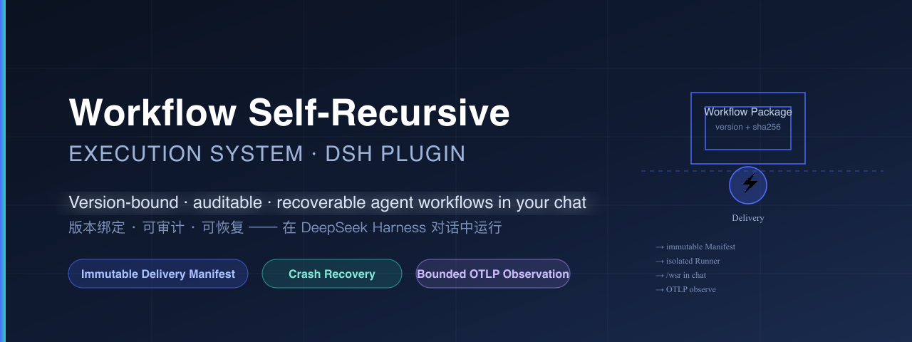
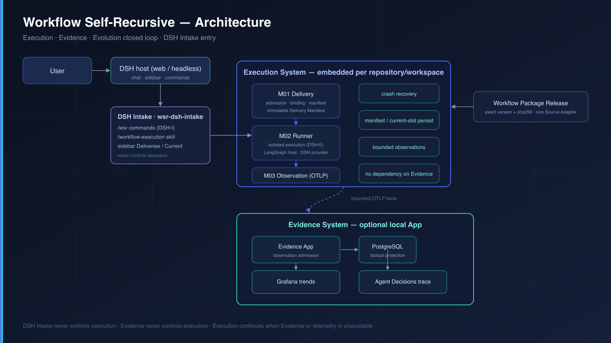

# Workflow Self-Recursive — Execution System

English | [中文](README.zh-CN.md)



[](LICENSE)
[](https://www.npmjs.com/package/wsr-execution)
[](https://www.npmjs.com/package/dsh-wsr-execution)
[](https://github.com/firestige/wsr-execution/actions)

**Turn every agent conversation into an auditable, recoverable, version-bound delivery.**

The Execution System is the host-neutral execution boundary of [workflow-self-recursive](https://github.com/firestige/workflow-self-recursive): it resolves and validates one *exact* Workflow Package, binds it in an *immutable* Delivery Manifest, coordinates the Delivery inside an isolated Runner-owned execution context, recovers from the last durable boundary after crashes, and emits *bounded* observations over OTLP — observation never controls execution.

## Delivery forms (交付形态)

The Execution System is a host-neutral product, not a plugin. DSH is one entry point among several:

| Form | Package | Audience |
|---|---|---|
| **Embedded library** | `wsr-execution` | Host-neutral embedding — import `ExecutionApplicationFactory` and bootstrap with `create(configFile, dependencies)` |
| **DSH plugin entry** | `dsh-wsr-execution` | DeepSeek Harness users — run workflows from chat and sidebar tabs |
| **CLI** | `execution-config` (in `wsr-execution`) | Configuration init / copy / validate / dump-effective |

The DSH plugin is the first product entry; every admitted Workflow Action runs in a Runner-owned, isolated DSH execution context (`DSH-E`), never in the Intake context (`DSH-I`).

## Why it exists

| Bare agent chat | What actually happens | Execution System |
|---|---|---|
| Execution is a black box | What the model did, and with which workflow definition, cannot be audited afterwards | Every Delivery binds one exact version + SHA-256 into an immutable Manifest |
| Interruptions lose state | After a crash or restart there is nowhere to look | Manifest/current-slot persist; `/wsr recover` resumes from the last durable boundary |
| Version drift | The same request can execute different definitions at different times | Exact `name@version` selectors, immutable GitHub assets, and a validated exact-content READY cache |
| Observation couples to execution | A telemetry outage can take the run down with it | One-way, best-effort OTLP; Execution continues when Evidence or telemetry is unavailable |

## How it works

Three modules carry the responsibility:

- **Delivery Binding** resolves one exact, locally `READY` Workflow Package (selector → validation → local `MISSING/STAGING/READY` store) and constructs the Manifest content.
- **Runtime Interaction** owns canonical worktree exclusivity, the current Delivery slot, Manifest persistence, Runtime invocation, recovery, and final handling.
- **Delivery Observation** maps outbound bounded facts to a one-way, best-effort OTLP profile without controlling execution.

The default Source is the configured `firestige/wsr-workflow-package` GitHub Release. `implementation-workflow@0.3.0` and `system-design-workflow@0.3.0` are downloaded, validated, and published to the local READY store; neither is embedded in an Execution artifact.




## Install (DSH entry, one command)

```sh
# 1. Approve the better-sqlite3 native build once (pnpm 11)
dsh plugin --profile web config set --location=project --json allowBuilds '{"better-sqlite3":true}'
# 2. Install the Execution bundle from the DSH release authority
dsh plugin --profile web add dsh-wsr-execution@0.1.0
```

Requires Node `>=24.12 <25` and DSH `0.1.1-rc.2`. The independently versioned DSH bundle is published by [firestige/wsr-dsh](https://github.com/firestige/wsr-dsh) and pins its compatible `wsr-execution` version.

## Quick start

1. Point the plugin at durable state files (outside the installation directory):

   ```yaml
   # $DSH_HOME/profiles/web/cordis.patch.yml — the workflow-execution row
   - id: workflow-execution
     config:
       configFile: /absolute/path/wsr-local/execution.yaml
       bindingFile: /absolute/path/wsr-local/dsh-intake-bindings.json
   ```

   Initialize the config with `execution-config init <path> yaml`, replace the `__REQUIRED__` values, and provision the referenced API key in an external DSH credential file.

2. Start DSH Web from the target worktree and create a Delivery from chat:

   ```text
   /wsr create implementation-workflow@0.3.0
   Implement the requested change and preserve existing user edits.
   ```

3. Watch progress in the same conversation, inspect the bound Delivery in the sidebar **Deliveries** / **Current status** tabs, answer multi-turn Actions in chat, and finish an interaction with `/wsr action finish`.

## Commands

```text
/wsr list                         # privacy-safe Delivery and worktree state
/wsr create <name@version>
/wsr recover [delivery-id]
/wsr status [delivery-id]
/wsr action finish
/wsr abandon <delivery-id>
```

The explicit first-party skill `/workflow-execution` performs exactly one closed operation through the DSH-I-only `workflow_execution_intake` tool.

## Compatibility

| Dimension | Requirement |
|---|---|
| Node.js | `>=24.12.0 <25` |
| DeepSeek Harness | `0.1.1-rc.2` (`@deepseek-ai/dsh`) |
| Workflow Package contract | `agentops.workflow-dsl@1.1.0` |
| Observation contract | `agentops.observation@1.0.0` |
| Checkpoint store | `better-sqlite3` (native build, approved via `allowBuilds`) |

## Known Limitations and Deferred Work

- **Developer preview** — version `0.1.x` is an MVP candidate for trusted local use by individuals and small teams; compatibility-breaking changes are possible.
- **Exclusive Session/Delivery binding** — the DSH Intake passes a private, typed, invocation-only proof of the exact registered conversation workspace; Execution derives and persists the canonical Git worktree, while Manifest/current-slot remain the durable Delivery/worktree authority. One Session, Delivery, and occupied worktree cannot be implicitly switched, shared, stolen, or released by timeout.
- **Observation disabled by default** — set `observation.enabled: true` with a loopback OTLP base `endpoint` to enable the non-controlling exporter.
- **DSH-only interactive surface** — the shipped `web` profile is the reference assembly; a custom profile contains only `dsh-base` and is not an interactive Intake surface.

## For maintainers

- **Release qualification** — see [the release process](https://github.com/firestige/workflow-self-recursive/blob/main/docs/guides/execution-release-process.md). `pnpm quickstart:prepare` builds and verifies both artifacts and initializes local E2E configuration in one operation.
- **Changelog** — generated from git history by `pnpm changelog:generate`; `pnpm changelog:check` (CI-gated) rejects hand-edited drift.
- **Local pre-release E2E** — [guide](https://github.com/firestige/workflow-self-recursive/blob/main/docs/guides/dsh-execution-local-e2e.md); final [DSH quickstart](https://github.com/firestige/workflow-self-recursive/blob/main/docs/guides/dsh-execution-quickstart.md); [configuration reference](https://github.com/firestige/workflow-self-recursive/blob/main/docs/reference/execution-configuration.md); [DSH Intake package reference](packages/dsh-intake/README.md).

### Direct embedding

For host-neutral embedding, import `ExecutionApplicationFactory`, `DefaultExecutionApplicationFactory`, `ExecutionRequest`, `TaskPrompt`, and the configuration types from the package root. Calling the default factory's `create(configFile, dependencies)` is the single production bootstrap path. The exact DSH runtime is an optional peer: package-root import/type consumers need not install it, while executing the current `dsh` Provider requires the embedding profile to provide `@deepseek-ai/dsh@0.1.1-rc.2`. The release includes `config/schema/execution.config.schema.json`, versioned defaults/examples, compiled TypeScript declarations, and `execution-config init|copy|validate|dump-effective`.

## Multi-Provider 2.0 candidate

`execution.config@2.0.0` contains no installation-wide Provider or model default. The embedding product registers any number of exact, immutable Agent Provider factories through `AgentProviderFactoryRegistry`; duplicate identities fail closed. Each Agent-action Role must be present in `<canonical-worktree>/.wsr/role-provider-bindings.json` with an exact Provider identity/version and Provider-owned model coordinate. Admission validates required Workflow capabilities, freezes the factory descriptor digest into `execution.delivery-manifest@2.0.0`, and never performs priority selection or fallback. Recovery accepts only the same descriptor and starts realms only for Providers actually used by the persisted Delivery. See `config/schema/execution.config.v2.schema.json`.

The package-root `createCopilotAgentProviderFactory()` registers `provider.copilot@1.0.78`. It imports the SDK bundled by the exact `@github/copilot@1.0.78` platform payload, reuses the local logged-in user through the SDK, and never asks the embedding host for token material. A Delivery realm admits only `github-copilot` model coordinates frozen for its Roles, runs sessions in the canonical worktree with an allowlisted Action tool surface, and fails closed on runtime, login, model, recovery, or binding drift.

## Get the source

This repository is normally consumed as a submodule of [workflow-self-recursive](https://github.com/firestige/workflow-self-recursive):

```sh
git clone --recurse-submodules https://github.com/firestige/workflow-self-recursive.git
```

To clone it standalone:

```sh
git clone https://github.com/firestige/wsr-execution.git
```

## Documentation

- [Execution System design](https://github.com/firestige/workflow-self-recursive/blob/main/docs/systems/execution/project-execution-system.md)
- [Conceptual architecture](https://github.com/firestige/workflow-self-recursive/blob/main/docs/agent-architecture.md)
- [Workflow composition model](https://github.com/firestige/workflow-self-recursive/blob/main/docs/workflow-composition-model.md)
- [Execution–Evidence interaction contract](https://github.com/firestige/workflow-self-recursive/blob/main/docs/contracts/execution-evidence/interaction-contract.md)
- [Planned first-party LangGraph runtime profile](https://github.com/firestige/workflow-self-recursive/blob/main/docs/systems/runtime/first-party-langgraph-runtime-profile.md)

## License

[Apache-2.0](LICENSE)
